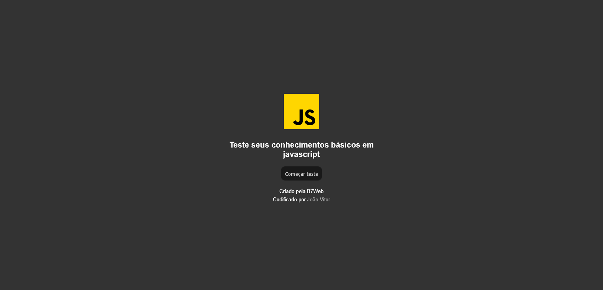
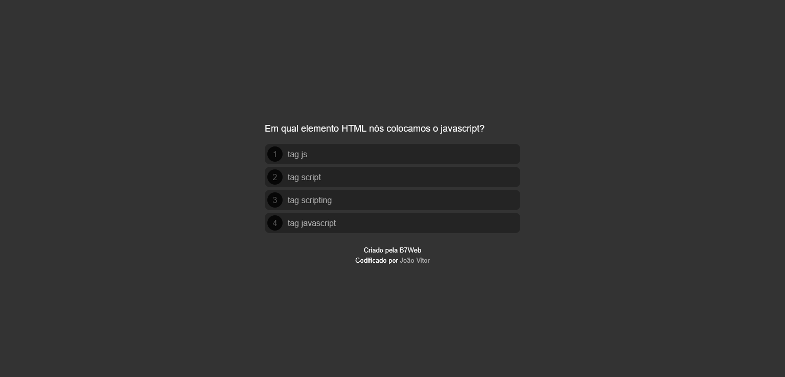
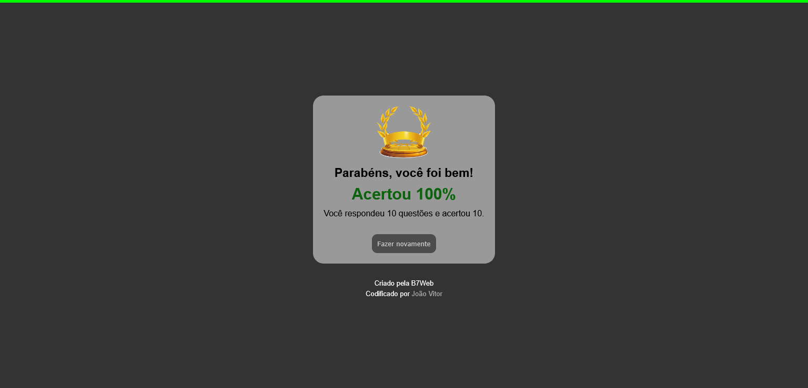

<h1 align="center">
    Aplicação de quiz
</h1>

Aplicação de quiz, onde são feitas perguntas sobre conhecimentos básicos de javascript. Projeto desenvolvido durante uma aula do curso da B7Web, com algumas modificações como, a adição de uma tela inicial no projeto

# Tabela de conteúdos

* [Demonstração do site](#gear-Demonstração-do-site)
* [Tecnologias](#computer-Tecnologias)
* [Licensa](#page_facing_up-Licensa)

# :gear: Demonstração do site

Visite a página aqui: https://jvuser01.github.io/quiz/

## Screenshots

    
    
    

# :computer: Tecnologias

Este projeto foi desenvolvido utilizando as seguintes tecnologias:

* HTML5
* CSS3
* Javascript

# :page_facing_up: Licensa

Este projeto foi desenvolvido em uma aula do curso da [B7Web](https://b7web.com.br/fullstack/), neste caso foram feitas algumas modificações.

Codado por [João Vitor](https://github.com/JVUser01) :rocket:. Esse projeto está sob a [licença MIT](LICENSE.txt).